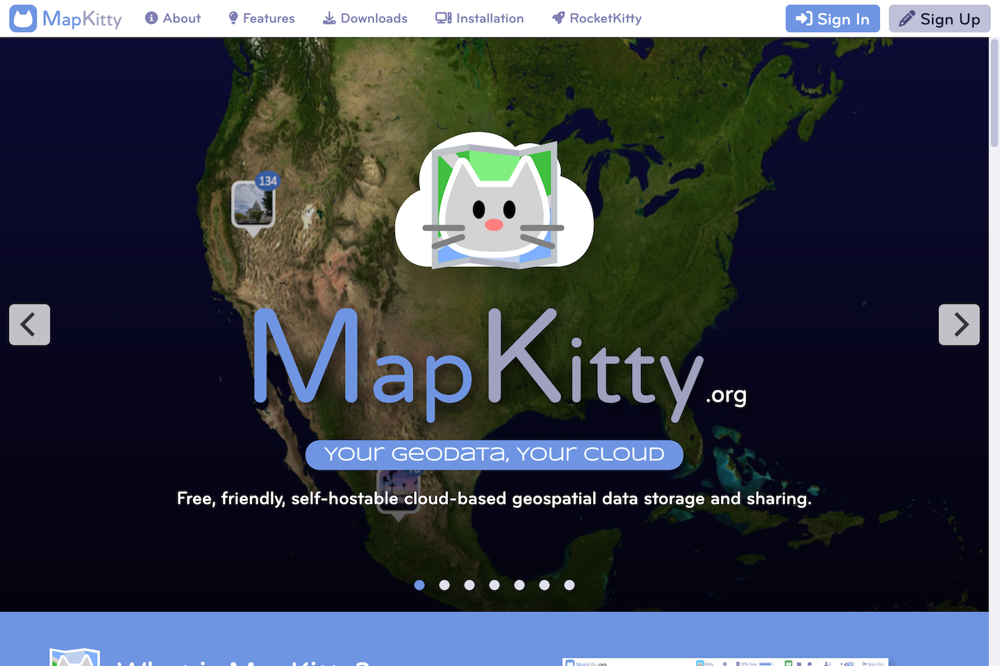

	

# MapKitty

MapKitty is a cloud-based geospatial image and data storage, management, and sharing system. Best of all, you can run it on your own server.

Welcome Screen

Desktop

## Features

- Map your geodata - Display geolocated photos and videos on a map.
- Geolocate your data - Assign geocoordinates to any file or folder.
- Easy to install - with a one-step Docker installation.
- Easy to use - works like the desktop and mobile systems you already know.
- Customizable - by users and site administrators.
- Platform independent - desktop or mobile.
- Self-hostable - run on your own server.

## Benefits

- Understand the spatial relationships present within your geodata.
- Manage your data hierarhically or geospatially - a geospatial operating system.
- Set up is quick and painless.
- Spend your time using instead of learning the platform.
- Personalize your MapKitty user experience.
- Run on any connected device.
- Take back control over your data from the tech giants.

## Live Demo

You can create an account and explore the features and benefits of the platform at [www.mapkitty.org](https://www.mapkitty.org).

## Installation

Please follow the instructions in [www.mapkitty.org/#installation](https://www.mapkitty.org/#installation) to install the software on your computer or web server.

## Instructions

See the [Sharedigm User Guide](https://www.sharedigm.com/#help) for instructions on how to use the platform.

## License

Distributed under the IndieSource License which allows unrestricted use of the software except by very large corporations. See [LICENSE.md](LICENSE.md) for more information.

## Contact

mailto:admin@sharedigm.com
